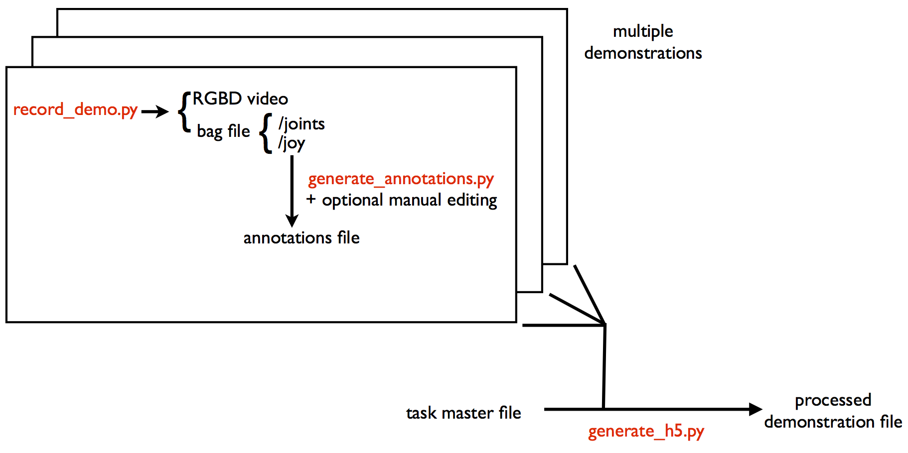
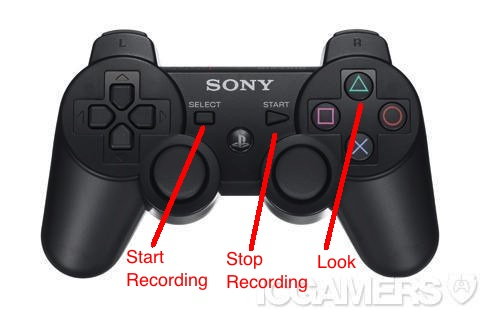

.. rapprentice documentation master file, created by
   sphinx-quickstart on Mon Apr 15 13:35:19 2013.
   You can adapt this file completely to your liking, but it should at least
   contain the root `toctree` directive.

********************************************************
Rapprentice: teaching robots by example
********************************************************

.. Contents:
.. 
.. .. toctree::
..    :maxdepth: 2
.. 
   
Dependencies and build procedure
==================================

Download the source from https://github.com/joschu/rapprentice

Dependencies:

- pcl >= 1.6
- `trajopt <https://github.com/joschu/trajopt>`_. devel branch. Build with the option BUILD_CLOUDPROC enabled.
- python modules: scipy, h5py, networkx, cv2 (OpenCV)

Build procedure:

- manually build the ``rgbd_video`` subdirectory. This contains a program for recording an RGB+Depth video (from Primesense cameras). Manually edit ``record_demo.py`` to point to the executable.
- add the rapprentice root directory to your ``PYTHONPATH``
   
Training
================================================

Overview
-----------

The training pipeline is illustrated below.

File formats:

- RGBD video: a directory with a series of png files (depth images, measured in millimeters) and jpg files (rgb images) and another file with the ROS timestamps.
- annotations file: yaml
- master task file: yaml
- processed demonstration file: hdf5

See the ``sampledata`` directory for examples of these formats.

Teaching procedure
---------------------

Use the ps3 controller to indicate "look", "start", and "stop" times.

Processing training data
--------------------------

You'll presumably collect multiple runs of the whole task. Then you run a script to generate an hdf5 file that aggregates all these demonstrations, which are broken into segments.

To see an example of how to run the data processing scripts, see the script ``example_pipeline/overhand.py``, which processes an example dataset, which contains demonstrations of tying an overhand knot in rope. To run the script, you'll need to download the sample data with ``scripts/download_sampledata.py``.

Execution
=============

::

  ./do_task.py h5file
  
You can run this program in various simulation configurations that let you test your algorithm without using the robot.

- By setting ``--exec_mode=fake`` you can execute the trajectories in OpenRAVE. Alternatively, you can leave ``--exec_mode=real`` (the default) but execute in Gazebo.
- By setting ``--sensor_mode=fake`` and ``--fake_data_segment=segmentname`` you can make the program use RGBD images from the demonstration instead of live data. By specifying ``--fake_data_transform`` you can transform the fake data, so the algorithm will have to generate a new trajectory.

Tips for debugging execution
-------------------------------

- First make sure plots are enabled for the registration algorithm so you can see the demonstration point cloud (or landmarks) being warped to match the current point cloud. Check that the transformation looks good and the transformation is sending the points to the right place.
- Next, enable plotting for the trajectory optimization algorithm. Look at the purple lines, which indicate the position error. Make sure the target positions and orientations (indicated by axes) are correct.
- Look at the output of the trajectory optimization algorithm, which might tell you if something funny is going on.

Extras
========

Various other scripts are included in the ``scripts`` directory:

- ``view_kinect.py``: view the live rgb+depth images from your Primesense camera.
- ``command_pr2.py``: for conveniently ordering the pr2 around, run ``ipython -i command_pr2.py``. Then you can control the pr2 with ipython by typing commands like ``pr2.rarm.goto_posure(`side`)`` or ``pr2.head.set_pan_tilt(0,1)``.
- ``animate_demo.py`` animates a demonstration.

Miscellaneous notes
=====================

``PR2.py`` is set up so you can send commands to multiple bodyparts simultaneously. So most of the commands, like ``goto_joint_positions`` are non-blocking. If you want to wait until all commands are done, do ``pr2.join_all()``.

Indices and tables
==================

* :ref:`genindex`
* :ref:`modindex`
* :ref:`search`

